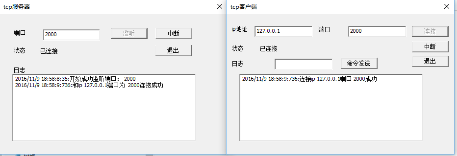
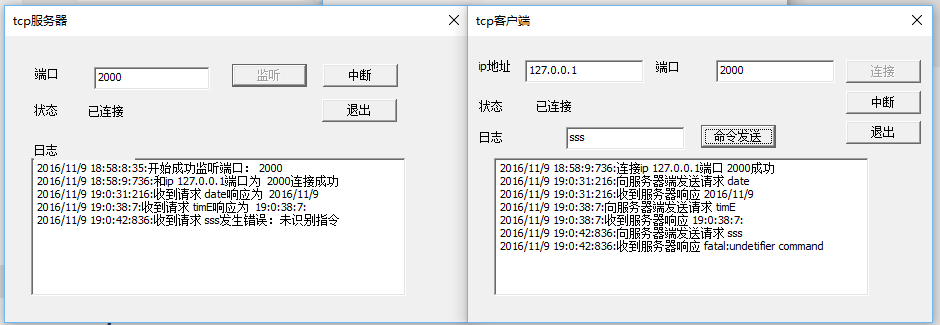
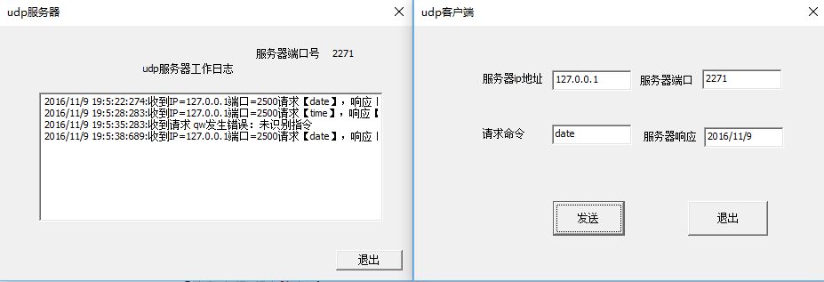
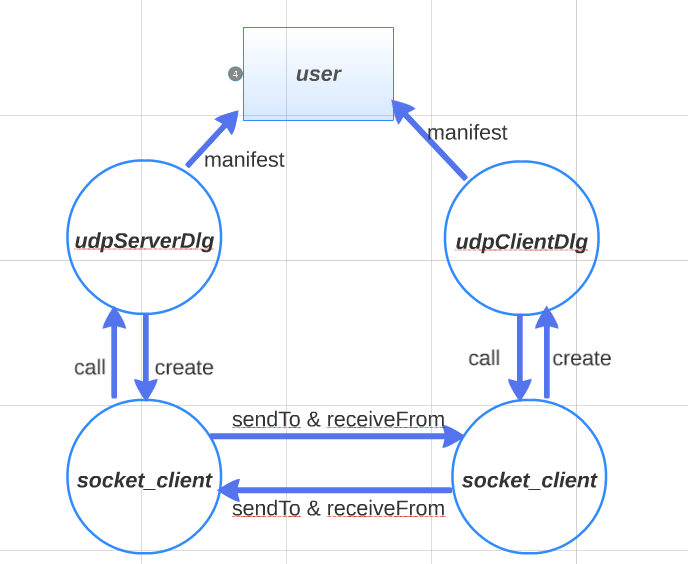
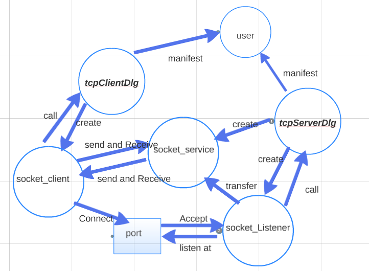

## 客户与服务器之间使用的协议进行设计
### 代码
```c
static CString protocal_table[20] = {
    "tcp client 001","tcp Server 001","DATE","TIME"
};
```
### tcp
服务器端 识别 "tcp client 001"和"DATE","TIME"大小写形式
客户端   识别 "tcp Server 001"


>握手协议用于确认两方建立连接，效果如下


>交互和错误识别
### udp
服务器端 识别 "DATE","TIME"大小写形式

>交互和错误识别

## 程序结构
启动应用以后，会进入主对话框类consoleWin，点击按钮初始化生成tcp服务器的对话框类tcpServerDlg，生成tcp客户端的对话框类tcpClientDlg，生成udp服务器的对话框类udpServerDlg，生成udp客户端的对话框类udpClientDlg

以下为两类socket框架流程图
>udp程序模型


>tcp程序模型
